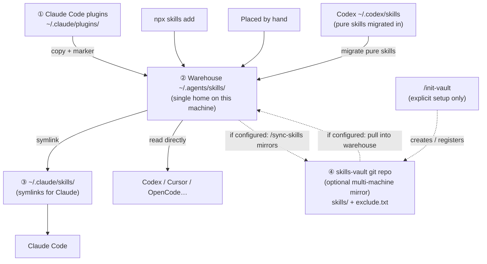

# skills-bridge

For people who use Claude Code **and** other agents: one shared library of skills.

[English](README.md) | [中文](README.zh-CN.md)

## With skills-vault (optional)

- **skills-vault**: content only (`skills/` + `exclude.txt`), no ops scripts
- **this plugin**: all commands (`sync-skills.sh` + `vault-mirror.sh`)
- **create/register**: skill `/init-vault` (only when you ask — never auto)
- **daily**: `/sync-skills` or `/skills-maintenance` mirrors **only if** a vault is already configured; otherwise vault is skipped silently (`--skip-vault` forces skip)

## What it does now (incl. Codex)

- **Claude**: copy pure plugin skills into `~/.agents/skills`; symlink repo skills into `~/.claude/skills`
- **Codex**: **migrate** pure skills from `~/.codex/skills` into agents and delete the `.codex` copy (no duplicate slash entries); keep `.system` / host-bound; remove `.codex → .claude` bypass symlinks
- Host-bound skills (hooks / MCP / built-in tools) stay out of the shared repo

## Why you need it

Each tool installs skills **in a different place**, and each only reads its own directory:

- Claude Code plugins land under `~/.claude/`
- Skills installed for Codex & friends (`npx skills add`) land under `~/.agents/`

So a plugin you install in Claude Code is invisible to Codex, and vice versa — one library per tool, install twice, maintain twice.

Worse, **not every plugin can be shared by moving files**: functional plugins (with hooks/MCP/commands/agents) bind their power to the host's machinery — copy the skill files elsewhere and they're dead weight. The only way to use them in another agent is to install the equivalent on that side, and until now, finding whether one exists and how to install it was all on you.

skills-bridge handles both: what can move goes into **the same warehouse** every tool reads (`~/.agents/skills/` — the standard directory Codex, Cursor, and the agentskills ecosystem natively scan); what can't, it detects which agents you have installed, searches the web for each one's equivalent install method, and installs it after your confirmation. It ships 3 skills:

| Skill | Job |
|---|---|
| `/sync-skills` | Two-way host sync; if a vault is configured, also pull/mirror it |
| `/skills-maintenance` | Update everything, then sync |
| `/init-vault` | Explicitly create or register a skills-vault (optional multi-machine mirror) |

## Install

In Claude Code:

```
/plugin marketplace add Apri1qing/skills-bridge
/plugin install skills-bridge@skills-bridge
```

## `/sync-skills` — two-way sync

Run it after installing, updating, or uninstalling a Claude Code plugin, or after `npx skills add`. One command, both directions:

**Forward (Claude plugins → warehouse).** Skills from pure-skills plugins are copied into the warehouse, immediately usable by Codex and friends. Each copy carries a `.synced-from-plugin` marker recording its source — only marker-holders may be overwritten or cleaned; anything you placed by hand is never touched. Copies of uninstalled plugins are cleaned up.

**Reverse (warehouse → Claude).** Skills that entered the warehouse without going through Claude Code — installed by `npx skills add`, written by hand — get a symlink entry in `~/.claude/skills/`, so Claude Code can use them immediately. Duplicate and dead entries are removed.

**Functional plugins (with hooks/MCP/commands/agents) don't cross.** Their skills are dead weight outside the host, so the script skips them — and the model picks up where the script stops: it detects which other agents you actually have installed (Codex, Gemini, …), searches the web for each one's equivalent install method, and installs it after your confirmation. It also flags synced skills whose content only makes sense inside Claude Code, suggesting them for the exclusion list.

Typical case: `frontend-slides` goes 1.0 → 2.1. Claude Code reads the plugin directory and uses the new version immediately, but Codex reads the *copy* in the warehouse, which doesn't change by itself — run `/sync-skills` and every copy is refreshed.

Just ask in natural language: want a preview of what it would do, or only a list of which skills are managed copies — say so, and the model picks the right way to run it.

## `/skills-maintenance` — update everything

Call it whenever you want everything current. Three steps in order:

1. Update the skills you installed with `npx skills add`
2. Update your Claude Code plugins
3. Run `/sync-skills` for the two-way sync

Then it hands you one summary table of what each step did.

## How it works

Three directories, and **the center is the warehouse — not any single tool**:



Understand this diagram and the rules are all inside it:

- **A skill enters ② by one of three roads**: copied from ① (forward sync); installed straight into ② by `npx skills add`; or placed there by you. **This is the channel that lets skills from the Codex/Cursor ecosystem reach Claude**: once it's in ②, Claude can use it
- **Two directions, two mechanisms**: ① → ② uses **copies** (plugin version directories move on upgrade, which breaks links; a copy is always complete and usable); ② → ③ uses **symlinks** (the warehouse path never changes, the link is safe, and it follows whatever the warehouse holds — `npx skills update` refreshes content and Claude gets the new version with zero action)
- **The marker** = the copy's ID card: it's what forward sync uses to know what it may overwrite, and what reverse sync uses to skip entries Claude already loads through the plugin itself
- **skills-vault is optional (④)**: use `/init-vault` once to create/register; `/sync-skills` then mirrors ② ↔ ④. If unset, ignore ④ entirely — no prompts
- **Functional plugins don't cross** (directory contains `hooks/`, `commands/`, `agents/`, `.mcp.json`): same rule for Claude plugins and Codex plugins alike — the way across is installing the equivalent on the other side, which `/sync-skills` helps you find and do

## Self-consistent by design

skills-bridge is itself a pure-skills plugin, so its own skills sync into the warehouse like everything else — any agent can trigger the sync, while Claude Code keeps reading the plugin original, and neither side interferes with the other. It applies the same rules to itself as to everyone else.

## License

MIT

