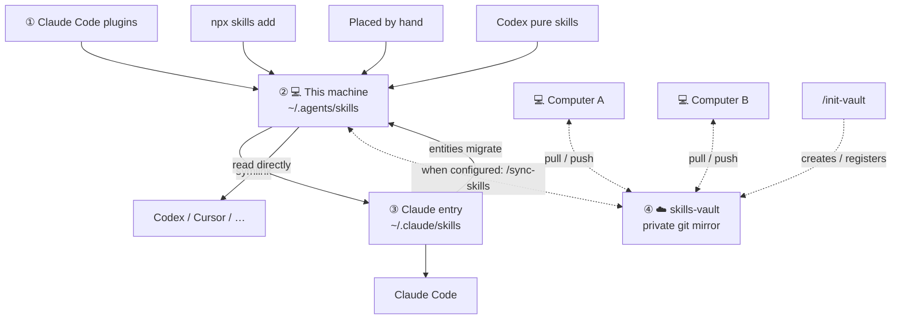

# skills-bridge

For people who use Claude Code **and** other agents: one shared library of skills.

[English](README.md) | [中文](README.zh-CN.md)

## Optional: share skills across machines

Your laptop, another PC, and your Grok cloud box can all connect to the **same private skills-vault**.

**First machine:**

1. Run `/init-vault` to create the private git repo
2. Run `/sync-skills` once to fill the vault and push

**Every other machine / Grok box:**

1. `git clone` the vault
2. Run `/init-vault` to register the local skills dir (`~/.agents/skills` on a computer, `/home/box/agent-data/workflows` on a Grok box)
3. Run `/sync-skills`

**Day to day:**

- Installed a skill on some machine? Run `/sync-skills` there to push it up
- On the other machines, run `/sync-skills` to pull it down
- A machine that only consumes (e.g. a Grok box that never pushes) can run `vault-mirror.sh pull` — fetch only, never writes the vault

**Merge rules** — what sync does when both sides have changed:

- The vault carries `skills-lock.json`, a per-skill provenance manifest (where each skill came from: `npx`, a Claude plugin, or hand-written). Vault-sourced skills are backfilled into the machine-local skills lock, so `npx skills update` recognises them everywhere
- `npx`-installed skills merge by lock identity: only the remote changed → remote wins (a stale machine can't clobber a newer vault); both changed → reported as a conflict, local wins, the other version stays in git history
- Claude-plugin skills follow the installed plugin — update the plugin (or run `/skills-maintenance`), then sync
- Hand-written skills are last-syncer-wins; the losing version is recoverable from the vault's git history

Don't need sharing? Ignore the vault — when it isn't configured, sync skips it quietly and single-machine sync works as usual.

## What it does

- **Claude → shared folder**: skills from pure-skills plugins are copied into `~/.agents/skills`, immediately usable by every other tool
- **Shared folder → Claude**: skills that entered the folder without Claude Code get a symlink in `~/.claude/skills`, immediately usable by Claude Code
- **Codex**: pure skills in `~/.codex/skills` migrate into the shared folder, leaving no duplicate behind
- **Claude hand-placed skills**: entity skill dirs in `~/.claude/skills` also migrate into the shared folder, replaced in place by a symlink so Claude Code keeps working unchanged
- Host-bound plugins (hooks / MCP / built-in tools) aren't moved by file — skills-bridge finds and installs the equivalent on the other side instead

## Why you need it

Each tool installs skills **in a different place**, and each only reads its own directory:

- Claude Code plugins land under `~/.claude/`
- Skills installed for Codex & friends (`npx skills add`) land under `~/.agents/`

So a plugin you install in Claude Code is invisible to Codex, and vice versa — one library per tool, install twice, maintain twice.

Worse, **not every plugin can be shared by moving files**: functional plugins (with hooks/MCP/commands/agents) bind their power to the host's machinery — copy the skill files elsewhere and they're dead weight. The only way to use them in another agent is to install the equivalent on that side, and until now, finding whether one exists and how to install it was all on you.

skills-bridge handles both: what can move goes into **the same warehouse** every tool reads (`~/.agents/skills/` — the standard directory Codex, Cursor, and the agentskills ecosystem natively scan); what can't, it detects which agents you have installed, searches the web for each one's equivalent install method, and installs it after your confirmation. It ships 3 skills:

| Skill | Job |
|---|---|
| `/sync-skills` | Keep Claude / Codex / the shared folder in sync (and your other machines if you set up vault) |
| `/skills-maintenance` | Update everything, then sync |
| `/init-vault` | One-time: set up sharing skills across your computers (optional) |

## Install

### `npx skills`

```bash
npx skills add Apri1qing/skills-bridge -g
```

### Claude Code plugin

```
/plugin marketplace add Apri1qing/skills-bridge
/plugin install skills-bridge@skills-bridge
```

## For agents

**Onboard me — paste this to your agent** (Claude Code, Codex, Grok Bot, any of them):

```text
Install skills-bridge and onboard me:
1. Read the "For agents" section of the README at
   https://github.com/Apri1qing/skills-bridge (README.zh-CN.md for Chinese).
2. Install skills-bridge for your environment and verify it works.
3. Ask me whether to share this skill library across my machines.
   If yes, run the /init-vault onboarding; if no, stop — nothing to configure.
```

Your agent can't fetch URLs (e.g. an offline box)? Paste the rest of this section to it directly. What it will walk you through:

A user pointing you at this section wants you to set skills-bridge up for them. Three steps.

**1. Know what you're installing.** skills-bridge keeps one shared skill library (`~/.agents/skills`) consistent across agents: skills installed for one agent become usable by the others (`/sync-skills` reconciles both directions), `/skills-maintenance` updates everything in one go, and an optional private git vault replicates the same library across the user's machines.

**2. Install for your environment, then verify:**

| You are | Install | Verify |
|---|---|---|
| Claude Code | `/plugin marketplace add Apri1qing/skills-bridge`, then `/plugin install skills-bridge@skills-bridge` | `/sync-skills` runs |
| Codex, or any agent reading `~/.agents/skills` | `npx skills add Apri1qing/skills-bridge -g` | `~/.agents/skills/sync-skills` exists |
| Grok Bot cloud box | the commands below | the skill dirs appear under `/home/box/agent-data/workflows` |

A Grok Bot box has no plugin system and no guaranteed Node — the install is plain git + cp (bash and git are the only requirements):

```bash
git clone https://github.com/Apri1qing/skills-bridge.git ~/skills-bridge
mkdir -p /home/box/agent-data/workflows
cp -r ~/skills-bridge/skills/* /home/box/agent-data/workflows/
```

Update later with `git -C ~/skills-bridge pull && cp -r ~/skills-bridge/skills/* /home/box/agent-data/workflows/`. On a box `/skills-maintenance` does not apply (its two update sources don't exist there); day-to-day is `/sync-skills`, or `vault-mirror.sh pull` for fetch-only.

**3. Ask the user one question: "Share this skill library across your machines?"**

- **Yes** → run the `/init-vault` onboarding: create a private vault (`bash <plugin>/skills/sync-skills/scripts/vault-mirror.sh init ~/skills-vault --repo OWNER/skills-vault`), or clone the user's existing vault and register this machine's skills dir (`bash <plugin>/skills/sync-skills/scripts/vault-mirror.sh setup ~/skills-vault <skills-dir>` — `/home/box/agent-data/workflows` on a Grok box). Then run `/sync-skills` once to fill or pull the vault.
- **No** → done. Single-machine sync is complete without the vault; nothing to configure.

Close by telling the user the day-to-day in one line: `/sync-skills` after installing or updating skills anywhere, `/skills-maintenance` to update everything.

## `/sync-skills` — two-way sync

Run it after installing, updating, or uninstalling a Claude Code plugin, or after `npx skills add`. One command, both directions:

**Forward (Claude plugins → warehouse).** Skills from pure-skills plugins are copied into the warehouse, immediately usable by Codex and friends. Each copy carries a `.synced-from-plugin` marker recording its source — only marker-holders may be overwritten or cleaned; anything you placed in the warehouse by hand is never touched. Copies of uninstalled plugins are cleaned up.

**Reverse (warehouse → Claude).** Skills that entered the warehouse without going through Claude Code — installed by `npx skills add`, written by hand — get a symlink entry in `~/.claude/skills/`, so Claude Code can use them immediately. Duplicate and dead entries are removed. And in the other direction, entity skills you placed by hand in `~/.claude/skills/` migrate into the warehouse, replaced in place by a symlink.

**Functional plugins (with hooks/MCP/commands/agents) don't cross.** Their skills are dead weight outside the host, so the script skips them and installs the equivalent instead: it detects which other agents you actually have installed (Codex, Gemini, …), searches the web for each one's equivalent install method, and installs it after your confirmation. It also flags synced skills whose content only makes sense inside Claude Code, suggesting them for the exclusion list.

Typical case: `frontend-slides` goes 1.0 → 2.1. Claude Code reads the plugin directory and uses the new version immediately, but Codex reads the *copy* in the warehouse, which doesn't change by itself — run `/sync-skills` and every copy is refreshed.

Want a preview of what it would do, or just a list of which skills are managed copies? Ask in natural language and the model picks the right way to run it.

## `/skills-maintenance` — update everything

Call it whenever you want everything current. Three steps in order:

1. Update the skills you installed with `npx skills add`
2. Update your Claude Code plugins
3. Run `/sync-skills` for the two-way sync

Then it hands you one summary table of what each step did.

## How it works

Three directories, and **the center is the warehouse — not any single tool**:


```mermaid
flowchart TB
    P["① Claude Code plugins"]
    N["npx skills add"]
    H["Placed by hand"]
    CX["Codex pure skills"]
    W["② 💻 This machine<br/>~/.agents/skills"]
    C["③ Claude entry<br/>~/.claude/skills"]
    V["④ ☁️ skills-vault<br/>private git mirror"]
    M1["💻 Computer A"]
    M2["💻 Computer B"]
    IV["/init-vault"]
    P --> W
    N --> W
    H --> W
    CX --> W
    W -->|"symlink"| C
    C -->|"entities migrate"| W
    C --> CC["Claude Code"]
    W -->|"read directly"| X["Codex / Cursor / …"]
    W <-.->|"when configured: /sync-skills"| V
    M1 <-.->|"pull / push"| V
    M2 <-.->|"pull / push"| V
    IV -.->|"creates / registers"| V
```

Understand this diagram and the rules are all inside it:

- **A skill enters ② by one of three roads**: copied from ① (forward sync); installed straight into ② by `npx skills add`; or placed there by you. **This is the channel that lets skills from the Codex/Cursor ecosystem reach Claude**: once it's in ②, Claude can use it
- **Two directions, two mechanisms**: ① → ② uses **copies** (plugin version directories move on upgrade, which breaks links; a copy is always complete and usable); ② → ③ uses **symlinks** (the warehouse path never changes, the link is safe, and it follows whatever the warehouse holds — `npx skills update` refreshes content and Claude gets the new version with zero action)
- **Codex pure skills get migrated**: copied into ②, then the `~/.codex/skills` original is deleted (no duplicate slash entries); `.system` and host-bound skills stay put; `.codex → .claude` bypass symlinks are removed
- **Entity skills in `~/.claude/skills` get migrated too**: copied into ②, original deleted, symlink left in place (the ③ entry) so Claude Code notices nothing; when the warehouse already has a hand-managed or plugin copy of the same name, the `.claude` source is kept or deduped. Entities in the Claude user skills dir are always treated as pure skills
- **The marker** = the copy's ID card: it's what forward sync uses to know what it may overwrite, and what reverse sync uses to skip entries Claude already loads through the plugin itself
- **④ is optional**: only if you ran `/init-vault`. Then sync keeps your machines’ skill folders aligned via that private git repo. Never set up? The diagram’s ④ simply doesn’t apply.
- **Functional plugins don't cross** (directory contains `hooks/`, `commands/`, `agents/`, `.mcp.json`): their skills are dead weight outside the host — the way across is installing the equivalent on the other side, which `/sync-skills` helps you find and do

## Self-consistent by design

skills-bridge is itself a pure-skills plugin, so its own skills sync into the warehouse like everything else — any agent can trigger the sync, while Claude Code keeps reading the plugin original, and neither side interferes with the other. It applies the same rules to itself as to everyone else.

## License

MIT
