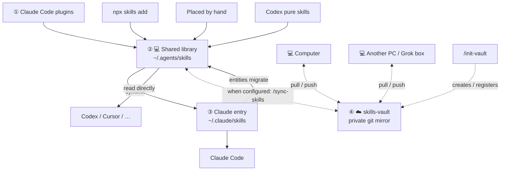

# skills-bridge

For people who use Claude Code **and** other agents: one shared library of skills.

[English](README.md) | [中文](README.zh-CN.md)

## Onboard — paste this to your agent

Claude Code, Codex, Grok Bot, any of them:

```text
Install skills-bridge and onboard me:
1. Read the full README at
   https://github.com/Apri1qing/skills-bridge (README.zh-CN.md for Chinese)
   so you can explain how skills-bridge and skills-vault relate.
2. Install skills-bridge for your environment and verify it works.
3. Ask me whether to share this skill library across my machines.
   If yes, run the /init-vault onboarding; if no, stop — nothing to configure.
```

## What it does

Each tool installs skills in its own place and only reads its own directory — a plugin you install in Claude Code is invisible to Codex, and vice versa. skills-bridge gives them one shared library (`~/.agents/skills`, the standard directory Codex, Cursor, and the agentskills ecosystem natively scan):

- **Claude → shared folder**: skills from pure-skills plugins are copied in, immediately usable by every other tool
- **Shared folder → Claude**: skills that arrived without Claude Code get a symlink entry in `~/.claude/skills`, immediately usable by Claude Code
- **Codex**: pure skills in `~/.codex/skills` migrate into the shared folder, leaving no duplicate behind
- **Hand-placed skills**: entity skill dirs in `~/.claude/skills` migrate too, replaced in place by a symlink so Claude Code keeps working unchanged
- **Host-bound plugins** (hooks / MCP / built-in tools) can't be shared by moving files — skills-bridge detects which other agents you have installed, searches for each one's equivalent install method, and installs it after your confirmation

The flow of skills at a glance:


```mermaid
flowchart TB
    P["① Claude Code plugins"]
    N["npx skills add"]
    H["Placed by hand"]
    CX["Codex pure skills"]
    W["② 💻 Shared library<br/>~/.agents/skills"]
    C["③ Claude entry<br/>~/.claude/skills"]
    V["④ ☁️ skills-vault<br/>private git mirror"]
    M1["💻 Computer"]
    M2["💻 Another PC / Grok box"]
    IV["/init-vault"]
    P --> W
    N --> W
    H --> W
    CX --> W
    W -->|"symlink"| C
    C -->|"entities migrate"| W
    C --> CC["Claude Code"]
    W -->|"read directly"| X["Codex / Cursor / …"]
    W <-.->|"when configured: /sync-skills"| V
    M1 <-.->|"pull / push"| V
    M2 <-.->|"pull / push"| V
    IV -.->|"creates / registers"| V
```

## Install

### `npx skills`

```bash
npx skills add Apri1qing/skills-bridge -g
```

### Claude Code plugin

```
/plugin marketplace add Apri1qing/skills-bridge
/plugin install skills-bridge@skills-bridge
```

## The three skills

| Skill | Job |
|---|---|
| `/sync-skills` | Keep Claude / Codex / the shared folder in sync (and your other machines, if you set up the vault) |
| `/skills-maintenance` | Update everything, then sync |
| `/init-vault` | One-time: set up sharing skills across your computers (optional) |

Run `/sync-skills` after installing, updating, or uninstalling skills anywhere; run `/skills-maintenance` when you want everything current. Typical case: a plugin goes 1.0 → 2.1 — Claude Code uses the new version immediately, but other tools read the *copy* in the shared folder; one `/sync-skills` refreshes every copy.

## For agents

Your job: get skills-bridge set up for the user. Three steps.

**1. Know what you're installing.** skills-bridge keeps one shared skill library (`~/.agents/skills`) consistent across agents: skills installed for one agent become usable by the others (`/sync-skills` reconciles both directions), `/skills-maintenance` updates everything in one go, and an optional private git vault replicates the same library across the user's machines.

**2. Install for your environment, then verify:**

| You are | Install | Verify |
|---|---|---|
| Claude Code | `/plugin marketplace add Apri1qing/skills-bridge`, then `/plugin install skills-bridge@skills-bridge` | `/sync-skills` runs |
| Codex, or any agent reading `~/.agents/skills` | `npx skills add Apri1qing/skills-bridge -g` | `~/.agents/skills/sync-skills` exists |
| Grok Bot cloud box | the commands below | the skill dirs appear under `/home/box/agent-data/workflows` |

A Grok Bot box has no plugin system and no guaranteed Node — the install is plain git + cp (bash and git are the only requirements):

```bash
git clone https://github.com/Apri1qing/skills-bridge.git ~/skills-bridge
mkdir -p /home/box/agent-data/workflows
cp -r ~/skills-bridge/skills/* /home/box/agent-data/workflows/
```

Update later with `git -C ~/skills-bridge pull && cp -r ~/skills-bridge/skills/* /home/box/agent-data/workflows/`. On a box `/skills-maintenance` does not apply (its two update sources don't exist there); day-to-day is `/sync-skills` — it works in both directions, so skills the user installs on the box flow back into the vault too (push needs git credentials).

**3. Ask the user one question: "Share this skill library across your machines?"**

- **Yes** → run the `/init-vault` skill: it creates a private vault, or registers the user's existing vault for this machine (the skills dir is `~/.agents/skills`, or `/home/box/agent-data/workflows` on a Grok box). Then run `/sync-skills` once to fill or pull the vault.
- **No** → done. Single-machine sync is complete without the vault; nothing to configure.

Close by telling the user the day-to-day in one line: `/sync-skills` after installing or updating skills anywhere, `/skills-maintenance` to update everything.

## Optional: share skills across machines

Your laptop, another PC, and your Grok cloud box can all connect to the **same private skills-vault** (a private git repo).

- **First machine**: run `/init-vault`, then `/sync-skills` once to fill the vault and push
- **Every other machine / Grok box**: `git clone` the vault, run `/init-vault` to register the local skills dir (`~/.agents/skills` on a computer, `/home/box/agent-data/workflows` on a Grok box), then `/sync-skills`
- **Day to day**: installed a skill somewhere? Run `/sync-skills` there to push it up, and on the other machines to pull it down — a Grok box works the same way (skills installed on the box flow back to the vault too)

Syncs are safe for your work: a stale machine can't clobber a newer vault, both-side changes are reported as conflicts and recoverable from the vault's git history, and vault-sourced skills stay updatable via `npx skills update` on every machine.

Don't need sharing? Ignore the vault — when it isn't configured, sync skips it quietly and single-machine sync works as usual.

## License

MIT
