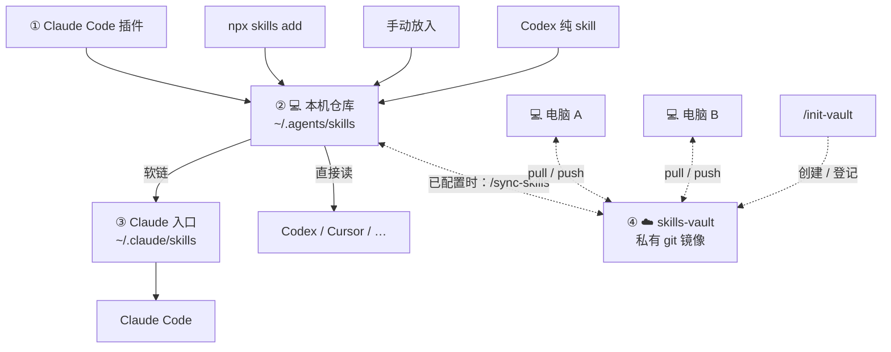

# skills-bridge

给同时使用 Claude Code 和其他 agent 的人：你的 skills，所有工具共用一份。

[English](README.md) | [中文](README.zh-CN.md)

## 可选：多台机器共用同一套 skill（含云端 box）

把每台环境都当成**对等节点**：笔记本、另一台电脑、云端 box（例如 Grok）都连**同一个私有 skills-vault**。

- **不需要共享？完全不用管 vault。** 单机同步照常。
- 第一台：跑 **`/init-vault`** 建私有 git 仓。
- 其他机器/box：`git clone` vault → **`/init-vault`** / `setup`，本机落点指到 `~/.agents/skills`（电脑）或 `/home/box/agent-data/workflows`（Grok box）→ 再跑 **`/sync-skills`**。
- 任意节点上新装的 skill：进本机落点 → sync → push；其他节点再 sync 即可更新。

没配置 vault → 同步安静跳过。不要再给 Grok 单独开旁路。

`/init-vault` 之后仓可能还是空的：再跑一次 **`/sync-skills`**，把本机 skill 灌进 vault 并 push。
`/init-vault` 成功后，agent 应马上问要不要立刻跑 `/sync-skills` 灌仓（别让用户停在空仓）。

## 它能做什么

- **Claude**：插件纯 skill → 拷贝进 `~/.agents/skills`；仓库 → `~/.claude/skills` 软链
- **Codex**：`~/.codex/skills` 里的纯 skill → **迁入** agents 并删除 `.codex` 实体（防双份）；`.system` 与绑宿主的留下；清掉 `.codex→.claude` 旁路软链
- 绑宿主（hooks / MCP / 内置工具等）不进公共仓库

## 为什么需要它

各个工具把 skill 装在**不同的地方**，又各自只认自己的目录：

- Claude Code 的插件装在 `~/.claude/` 下
- 给 Codex 等工具装的 skill（`npx skills add`）落在 `~/.agents/` 下

于是 Claude Code 装的插件 Codex 看不见，反过来也一样——每个工具一个库，装两遍、维护两遍。

更麻烦的是，**并非所有插件都能靠搬文件共享**：带 hooks/MCP/命令/agents 的功能型插件，其能力绑定在宿主机制上，skill 文件搬过去也是废纸。这部分插件想在其他 agent 用上，唯一的路是在对面装等价物——找没找得到、怎么装，以前全靠自己查。

skills-bridge 把这两件事都接了：能搬的搬进所有工具读的**同一个仓库**（`~/.agents/skills/`——Codex、Cursor 和 agentskills 生态原生扫描的标准目录）；搬不了的，探测你本地在装的 agent、联网查等价装法、经你确认后装上。一共 3 个 skill：

| Skill | 职责 |
|---|---|
| `/sync-skills` | 让 Claude / Codex / 公共目录对齐（若已配置 vault，也同步到其他电脑） |
| `/skills-maintenance` | 先更新一切，再同步 |
| `/init-vault` | 一次性：配置「多台电脑共用 skill」（可选） |

## 安装

在 Claude Code 里：

```
/plugin marketplace add Apri1qing/skills-bridge
/plugin install skills-bridge@skills-bridge
```

## `/sync-skills` — 双向同步

装/升级/卸载 Claude Code 插件后，或 `npx skills add` 之后，跑一次。一条命令，两个方向：

**正向（Claude 插件 → 仓库）。** 纯 skills 插件的 skill 复制进公共仓库，Codex 等工具即刻可用。每个副本带 `.synced-from-plugin` marker 记录来源——只有带 marker 的才允许被覆盖和清理，你手动放的永远不被碰。卸载插件的副本一并清理。

**反向（仓库 → Claude）。** 不经 Claude Code 进仓库的 skill——`npx skills add` 装的、手写的——补上 `~/.claude/skills/` 软链接入口，Claude Code 马上可用。双份入口和断链一并清掉。

**功能型插件（带 hooks/MCP/命令/agents）不搬。** 其 skills 离开宿主就是废纸，脚本直接跳过——脚本停下的地方由模型接手：探测本地实际在装的其他 agent（Codex、Gemini 等），联网查各家的等价安装方式，经你确认后装上。同步进来的 skill 里内容只对 Claude Code 有意义的，也会被点名建议进排除名单。

典型场景：`frontend-slides` 从 1.0 升到 2.1。Claude Code 直接读插件目录、马上用新版，但 Codex 读的是仓库里的*副本*、不会自己变——跑一次 `/sync-skills`，所有副本立刻刷新。

用自然语言提要求就行：想先看看会做什么、只想列出哪些 skill 是受管副本，直接说，模型会选对应的执行方式。

## `/skills-maintenance` — 一键更新

想让一切保持最新的时候调用。依次三步：

1. 更新你用 `npx skills add` 装的那些 skills
2. 更新 Claude Code 的插件
3. 调用 `/sync-skills` 做双向同步

最后给你一张汇总表，每步做了什么一目了然。

## 它是怎么工作的

三个目录，**中心是公共仓库，不是任何一个工具**：



读懂这张图，规则就都在里面了：

- **skill 进 ② 有三条路**：从 ① 复制（正向同步）；`npx skills add` 直接装进 ②；你手动放进 ②。**这就是"Codex/Cursor 生态装来的 skill 给 Claude 用"的通道**：只要进了 ②，Claude 就能用
- **两个方向、两种机制**：① → ② 用**复制**（插件升级时目录名会变，软链接会断，副本任何时刻都完整可用）；② → ③ 用**软链接**（公共仓库的路径永不变，链接安全，仓库内容更新了链接自动跟随——`npx skills update` 刷新后 Claude 零动作即用新版）
- **marker 标记** = 副本的身份证：正向同步靠它判断什么可以覆盖，反向同步靠它跳过 Claude 已通过插件真身加载的条目
- **④ 可选**：只有跑过 `/init-vault` 才有。之后同步会靠这份私有 git 把各台机器的 skill 目录对齐。从未设置？图里的 ④ 直接当不存在。
- **功能型插件不搬**（目录含 `hooks/`、`commands/`、`agents/`、`.mcp.json`）：对 Claude 插件和 Codex 插件一视同仁——过桥的办法是在对面装等价物，`/sync-skills` 会帮你查、帮你装

## 设计自洽

skills-bridge 自己也是纯 skills 插件，它自己的 skill 同样被同步进公共仓库——任何 agent 都能触发同步，Claude Code 侧继续读插件真身，两边互不干扰。它对自己执行和别人一样的规则。

## 许可

MIT

