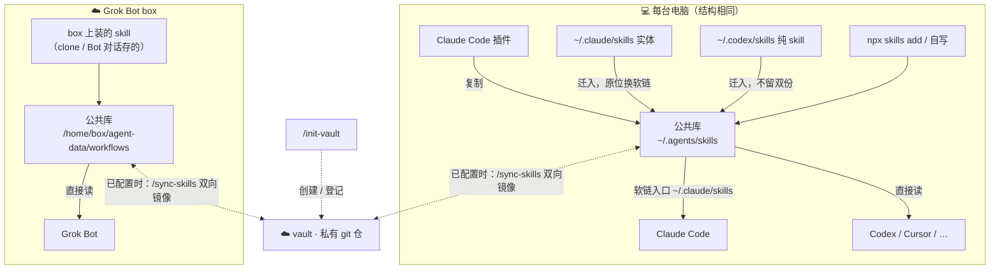

# skills-bridge

给同时使用 Claude Code 和其他 agent 的人：你的 skills，所有工具共用一份。

[English](README.md) | [中文](README.zh-CN.md)

## Onboard——把这段贴给你的 agent

Claude Code、Codex、Grok Bot 都行：

```text
为我安装并配置 skills-bridge：
1. 通读整个 README（https://github.com/Apri1qing/skills-bridge，
   中文版 README.zh-CN.md），理解 skills-bridge 和 skills-vault 的关系。
2. 按你自己的环境安装 skills-bridge，并验证装好了。
3. 问我：要不要把这个公共库镜像到我的多台机器。
   要，就走 /init-vault 引导；不要就到此为止，无需任何配置。
```

## 它能做什么

每个 agent 的 skill 装在各自的地方、只认自己的目录。skills-bridge 在中间放一个**公共库**（`~/.agents/skills`，Codex、Cursor 和 agentskills 生态原生扫描的标准目录），把各家的 skill 接进来：

**Claude Code**（skill 有两个来源）

- 插件型：纯 skills 插件里的 skill **复制**进公共库，其他工具立刻可用
- `~/.claude/skills` 型：实体 skill **迁入**公共库，原位换成软链——Claude Code 无感继续用
- 反向连接：公共库里 Claude 还没有的 skill，在 `~/.claude/skills` 补一个软链入口，Claude Code 立刻可用

**Codex**

- `~/.codex/skills` 里的纯 skill **迁入**公共库，不留双份
- Codex 直接读公共库目录，不需要入口

**npx skills 生态 / 其他 agent**

- `npx skills add` 直接装进公共库；所有读 `~/.agents/skills` 的 agent（Cursor 等）天然共享

**Grok Bot box**

- box 上的公共库就是 `/home/box/agent-data/workflows`，经 `/init-vault` 登记后通过 vault 与其他机器互通

**绑宿主的功能型插件**（hooks / MCP / 内置工具）没法靠搬文件共享——skills-bridge 探测你装了哪些其他 agent，联网查各家的等价装法，经你确认后装上。

两个库的命名：**公共库** = `~/.agents/skills`，本机所有 agent 共享的目录；**vault** = `skills-vault`，把公共库镜像到多台机器的私有 git 仓。

skill 的流向一图看全：


```mermaid
flowchart TB
    subgraph M1["💻 每台电脑（结构相同）"]
        P["Claude Code 插件"]
        E["~/.claude/skills 实体"]
        DX["~/.codex/skills 纯 skill"]
        N["npx skills add / 自写"]
        W1["公共库<br/>~/.agents/skills"]
        CC["Claude Code"]
        CX["Codex / Cursor / …"]
        P -->|"复制"| W1
        E -->|"迁入，原位换软链"| W1
        DX -->|"迁入，不留双份"| W1
        N --> W1
        W1 -->|"软链入口 ~/.claude/skills"| CC
        W1 -->|"直接读"| CX
    end
    subgraph M2["☁️ Grok Bot box"]
        B["box 上装的 skill<br/>（clone / Bot 对话存的）"]
        W2["公共库<br/>/home/box/agent-data/workflows"]
        GB["Grok Bot"]
        B --> W2
        W2 -->|"直接读"| GB
    end
    V["☁️ vault · 私有 git 仓"]
    IV["/init-vault"]
    W1 <-.->|"已配置时：/sync-skills 双向镜像"| V
    W2 <-.->|"已配置时：/sync-skills 双向镜像"| V
    IV -.->|"创建 / 登记"| V
```

## 安装

### `npx skills`

```bash
npx skills add Apri1qing/skills-bridge -g
```

### Claude Code 插件

```
/plugin marketplace add Apri1qing/skills-bridge
/plugin install skills-bridge@skills-bridge
```

## 三个 skill

| Skill | 职责 |
|---|---|
| `/sync-skills` | 让 Claude / Codex / 公共库对齐（若已配置 vault，也同步到其他电脑） |
| `/skills-maintenance` | 先更新一切，再同步 |
| `/init-vault` | 一次性：配置「多台电脑共用 skill」（可选） |

任何地方装了、更新了、卸载了 skill，跑一次 `/sync-skills`；想让一切保持最新，跑 `/skills-maintenance`。典型场景：插件从 1.0 升到 2.1——Claude Code 马上用新版，但其他工具读的是公共库里的*副本*，一次 `/sync-skills` 全部刷新。

## 给 agent 的话

你的任务：替用户装好 skills-bridge。三步。

**1. 知道自己在装什么。** skills-bridge 让所有 agent 共用一个公共库（`~/.agents/skills`）：给某个 agent 装的 skill 其他 agent 也能用（`/sync-skills` 双向对齐）；`/skills-maintenance` 一键更新一切；可选的 vault 把公共库镜像到用户的多台机器。

**2. 按自己的环境安装，并验证：**

| 你是 | 安装 | 验证 |
|---|---|---|
| Claude Code | `/plugin marketplace add Apri1qing/skills-bridge`，再 `/plugin install skills-bridge@skills-bridge` | `/sync-skills` 能跑 |
| Codex，或任何读 `~/.agents/skills` 的 agent | `npx skills add Apri1qing/skills-bridge -g` | `~/.agents/skills/sync-skills` 存在 |
| Grok Bot 云端 box | 下面这组命令 | `/home/box/agent-data/workflows` 下出现各 skill 目录 |

Grok Bot 的 box 没有插件系统、也不保证有 Node——安装就是纯 git + cp（只要求 bash 和 git）：

```bash
git clone https://github.com/Apri1qing/skills-bridge.git ~/skills-bridge
mkdir -p /home/box/agent-data/workflows
cp -r ~/skills-bridge/skills/* /home/box/agent-data/workflows/
```

之后升级用 `git -C ~/skills-bridge pull && cp -r ~/skills-bridge/skills/* /home/box/agent-data/workflows/`。box 上 `/skills-maintenance` 不适用（它的两个更新源都不存在），日常就是 `/sync-skills`——它是双向的，用户在 box 上装的 skill 同样会回流 vault（push 需要配好 git 凭据）。

**3. 问用户一个问题：「要把这个公共库镜像到你的多台机器吗？」**

- **要** → 跑 `/init-vault` skill。它会先问用户是否已有远端 vault 仓库：没有 → 从零创建（可选连 GitHub 私有仓一起建好）；有 → 向用户要仓库地址，clone 到本机并登记（配置 vault 位置和本机 skill 落点：电脑是 `~/.agents/skills`，Grok box 是 `/home/box/agent-data/workflows`）。然后跑一次 `/sync-skills` 灌仓或拉取。
- **不要** → 到此为止。单机同步不依赖 vault，无需任何配置。

最后用一句话告诉用户日常用法：任何地方装了/更新了 skill 就跑 `/sync-skills`；要一键更新一切就跑 `/skills-maintenance`。

## 可选：多台机器共用同一套 skill

笔记本、另一台电脑、Grok 云端 box，都可以连到**同一个私有 skills-vault**（一个私有 git 仓）。

- **第一台机器**：跑 `/init-vault`，再跑一次 `/sync-skills` 灌仓并 push
- **其他机器 / Grok box**：`git clone` vault 仓库，跑 `/init-vault` 登记本机 skill 落点（电脑是 `~/.agents/skills`，Grok box 是 `/home/box/agent-data/workflows`），然后 `/sync-skills`
- **日常**：任何一台新装了 skill，在那台跑 `/sync-skills` 推上去，其他机器跑 `/sync-skills` 拉下来——Grok box 同样如此（box 上装的 skill 也会回流 vault）

同步不会弄丢你的工作：陈旧的机器打不回较新的 vault，两边都变会报 CONFLICT、可从 vault 的 git 历史找回，vault 来的 skill 在每台机器上都能 `npx skills update`。

不需要多机共享？完全不用管 vault——没配置时同步会自动跳过它，单机照常。

## 许可

MIT
