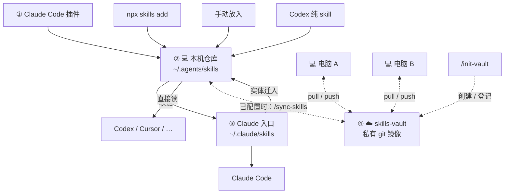

# skills-bridge

给同时使用 Claude Code 和其他 agent 的人：你的 skills，所有工具共用一份。

[English](README.md) | [中文](README.zh-CN.md)

## 可选：多台机器共用同一套 skill

笔记本、另一台电脑、Grok 云端 box，都可以连到**同一个私有 skills-vault**。

**第一台机器：**

1. 跑 `/init-vault`，创建私有 git 仓
2. 再跑一次 `/sync-skills`，把本机 skill 灌进仓并 push

**其他机器 / Grok box：**

1. `git clone` vault 仓库
2. 跑 `/init-vault`，登记本机 skill 落点（电脑是 `~/.agents/skills`，Grok box 是 `/home/box/agent-data/workflows`）
3. 跑 `/sync-skills`

**之后的日常：**

- 任何一台新装了 skill：在那台跑 `/sync-skills` 推上去
- 其他机器：跑 `/sync-skills` 拉下来
- 纯消费的机器（比如只拉不推的 Grok box）可以用 `vault-mirror.sh pull`——只拉取，永不写 vault

**合并规则**——两边都变过时 sync 怎么判：

- vault 带 `skills-lock.json`，记录每个 skill 的来源（`npx` / Claude 插件 / 手写）。vault 来的 skill 会回填进本机 skills lock，所以 `npx skills update` 在每台机器上都认识它们
- `npx` 装的 skill 按 lock 身份合并：只有远端变 → 远端赢（陈旧的机器打不回较新的 vault）；两边都变 → 报 CONFLICT、本地赢，另一版留在 git 历史里
- Claude 插件来的 skill 跟着已安装的插件走——先更新插件（或跑 `/skills-maintenance`）再同步
- 手写 skill 为后同步者胜；被覆盖的版本可从 vault 的 git 历史找回

不需要多机共享？完全不用管 vault——没配置时同步会自动跳过它，单机照常。

## 它能做什么

- **Claude → 公共仓库**：插件里的纯 skill 复制进 `~/.agents/skills`，其他工具立刻能用
- **公共仓库 → Claude**：仓库里的 skill 软链进 `~/.claude/skills`，Claude Code 立刻能用
- **Codex**：`~/.codex/skills` 里的纯 skill 迁进公共仓库，不留双份
- **Claude 手放实体**：`~/.claude/skills` 里的实体 skill 同样迁进公共仓库，原位换成软链，Claude Code 无感继续用
- 绑宿主的功能型插件（hooks / MCP / 命令）不搬文件，改为帮你在对面装等价物

## 为什么需要它

各个工具把 skill 装在**不同的地方**，又各自只认自己的目录：

- Claude Code 的插件装在 `~/.claude/` 下
- 给 Codex 等工具装的 skill（`npx skills add`）落在 `~/.agents/` 下

于是 Claude Code 装的插件 Codex 看不见，反过来也一样——每个工具一个库，装两遍、维护两遍。

更麻烦的是，**并非所有插件都能靠搬文件共享**：带 hooks/MCP/命令/agents 的功能型插件，其能力绑定在宿主机制上，skill 文件搬过去也是废纸。这部分插件想在其他 agent 用上，唯一的路是在对面装等价物——找不找得到、怎么装，以前全靠自己查。

skills-bridge 把这两件事都接了：能搬的搬进所有工具读的**同一个仓库**（`~/.agents/skills/`——Codex、Cursor 和 agentskills 生态原生扫描的标准目录）；搬不了的，探测本地装了哪些 agent、联网查等价装法、经你确认后装上。一共 3 个 skill：

| Skill | 职责 |
|---|---|
| `/sync-skills` | 让 Claude / Codex / 公共目录对齐（若已配置 vault，也同步到其他电脑） |
| `/skills-maintenance` | 先更新一切，再同步 |
| `/init-vault` | 一次性：配置「多台电脑共用 skill」（可选） |

## 安装

### `npx skills`

```bash
npx skills add Apri1qing/skills-bridge -g
```

### Claude Code 插件

```
/plugin marketplace add Apri1qing/skills-bridge
/plugin install skills-bridge@skills-bridge
```

## 给 agent 的话

用户把这段指给你看，就是想让你替他把 skills-bridge 配好。三步。

**1. 知道自己在装什么。** skills-bridge 让所有 agent 共用一个 skill 库（`~/.agents/skills`）：给某个 agent 装的 skill 其他 agent 也能用（`/sync-skills` 双向对齐）；`/skills-maintenance` 一键更新一切；可选的私有 git vault 让同一个库跟着用户跨机器走。

**2. 按自己的环境安装，并验证：**

| 你是 | 安装 | 验证 |
|---|---|---|
| Claude Code | `/plugin marketplace add Apri1qing/skills-bridge`，再 `/plugin install skills-bridge@skills-bridge` | `/sync-skills` 能跑 |
| Codex，或任何读 `~/.agents/skills` 的 agent | `npx skills add Apri1qing/skills-bridge -g` | `~/.agents/skills/sync-skills` 存在 |
| Grok Bot 云端 box | 下面这组命令 | `/home/box/agent-data/workflows` 下出现各 skill 目录 |

Grok Bot 的 box 没有插件系统、也不保证有 Node——安装就是纯 git + cp（只要求 bash 和 git）：

```bash
git clone https://github.com/Apri1qing/skills-bridge.git ~/skills-bridge
mkdir -p /home/box/agent-data/workflows
cp -r ~/skills-bridge/skills/* /home/box/agent-data/workflows/
```

之后升级用 `git -C ~/skills-bridge pull && cp -r ~/skills-bridge/skills/* /home/box/agent-data/workflows/`。box 上 `/skills-maintenance` 不适用（它的两个更新源都不存在），日常就是 `/sync-skills`，或 `vault-mirror.sh pull` 只拉不推。

**3. 问用户一个问题：「要把这套 skill 库在你的多台机器间共享吗？」**

- **要** → 走 `/init-vault` 引导：创建私有 vault（`bash <插件>/skills/sync-skills/scripts/vault-mirror.sh init ~/skills-vault --repo OWNER/skills-vault`），或 clone 用户已有的 vault 并登记本机 skill 落点（`bash <插件>/skills/sync-skills/scripts/vault-mirror.sh setup ~/skills-vault <skills目录>`，Grok box 是 `/home/box/agent-data/workflows`）。然后跑一次 `/sync-skills` 灌仓或拉取。
- **不要** → 到此为止。单机同步不依赖 vault，无需任何配置。

最后用一句话告诉用户日常用法：任何地方装了/更新了 skill 就跑 `/sync-skills`；要一键更新一切就跑 `/skills-maintenance`。

## `/sync-skills` — 双向同步

装/升级/卸载 Claude Code 插件后，或 `npx skills add` 之后，跑一次。一条命令，两个方向：

**正向（Claude 插件 → 仓库）。** 纯 skills 插件的 skill 复制进公共仓库，Codex 等工具即刻可用。每个副本带 `.synced-from-plugin` marker 记录来源——只有带 marker 的才允许被覆盖和清理，你手动放进仓库的永远不被碰。卸载插件的副本一并清理。

**反向（仓库 → Claude）。** 不经 Claude Code 进仓库的 skill——`npx skills add` 装的、手写的——补上 `~/.claude/skills/` 软链接入口，Claude Code 马上可用。双份入口和断链一并清掉。反过来，你手动放在 `~/.claude/skills/` 的实体 skill 也会被迁进公共仓库，原位换成软链。

**功能型插件（带 hooks/MCP/命令/agents）不搬。** 其 skills 离开宿主就是废纸，脚本直接跳过，转而帮你装等价物：探测本地实际在装的其他 agent（Codex、Gemini 等），联网查各家的等价安装方式，经你确认后装上。内容只对 Claude Code 有意义的 skill，也会被点名建议进排除名单。

典型场景：`frontend-slides` 从 1.0 升到 2.1。Claude Code 直接读插件目录、马上用新版，但 Codex 读的是仓库里的*副本*、不会自己变——跑一次 `/sync-skills`，所有副本立刻刷新。

想先看看会做什么、只想列出哪些 skill 是受管副本？直接用自然语言说，模型会选对应的执行方式。

## `/skills-maintenance` — 一键更新

想让一切保持最新的时候调用。依次三步：

1. 更新你用 `npx skills add` 装的那些 skills
2. 更新 Claude Code 的插件
3. 调用 `/sync-skills` 做双向同步

最后给你一张汇总表，每步做了什么一目了然。

## 它是怎么工作的

三个目录，**中心是公共仓库，不是任何一个工具**：


```mermaid
flowchart TB
    P["① Claude Code 插件"]
    N["npx skills add"]
    H["手动放入"]
    CX["Codex 纯 skill"]
    W["② 💻 本机仓库<br/>~/.agents/skills"]
    C["③ Claude 入口<br/>~/.claude/skills"]
    V["④ ☁️ skills-vault<br/>私有 git 镜像"]
    M1["💻 电脑 A"]
    M2["💻 电脑 B"]
    IV["/init-vault"]
    P --> W
    N --> W
    H --> W
    CX --> W
    W -->|"软链"| C
    C -->|"实体迁入"| W
    C --> CC["Claude Code"]
    W -->|"直接读"| X["Codex / Cursor / …"]
    W <-.->|"已配置时：/sync-skills"| V
    M1 <-.->|"pull / push"| V
    M2 <-.->|"pull / push"| V
    IV -.->|"创建 / 登记"| V
```

读懂这张图，规则就都在里面了：

- **skill 进 ② 有三条路**：从 ① 复制（正向同步）；`npx skills add` 直接装进 ②；你手动放进 ②。**这就是"Codex/Cursor 生态装来的 skill 给 Claude 用"的通道**：只要进了 ②，Claude 就能用
- **两个方向、两种机制**：① → ② 用**复制**（插件升级时目录名会变，软链接会断，副本任何时刻都完整可用）；② → ③ 用**软链接**（公共仓库的路径永不变，链接安全，仓库内容更新了链接自动跟随——`npx skills update` 刷新后 Claude 零动作即用新版）
- **Codex 纯 skill 会被迁走**：拷进 ② 后删除 `~/.codex/skills` 里的原目录（防双份）；`.system` 系统 skill 和绑宿主的留在原地；指向 `.claude` 的旁路软链一并清掉
- **`~/.claude/skills` 的实体同样会被迁走**：拷进 ② 后删除原目录、原位补软链（即 ③ 的入口），Claude Code 无感；agents 里已有手管同名或插件副本时保留 `.claude` 源或去重。Claude 用户 skill 目录里的实体一律按纯 skill 处理
- **marker 标记** = 副本的身份证：正向同步靠它判断什么可以覆盖，反向同步靠它跳过 Claude 已通过插件真身加载的条目
- **④ 可选**：只有跑过 `/init-vault` 才有。之后同步会靠这份私有 git 把各台机器的 skill 目录对齐。从未设置？图里的 ④ 直接当不存在。
- **功能型插件不搬**（目录含 `hooks/`、`commands/`、`agents/`、`.mcp.json`）：其 skills 离开宿主就是废纸——过桥的办法是在对面装等价物，`/sync-skills` 会帮你查、帮你装

## 设计自洽

skills-bridge 自己也是纯 skills 插件，它自己的 skill 同样被同步进公共仓库——任何 agent 都能触发同步，Claude Code 侧继续读插件真身，两边互不干扰。它对自己执行和别人一样的规则。

## 许可

MIT
